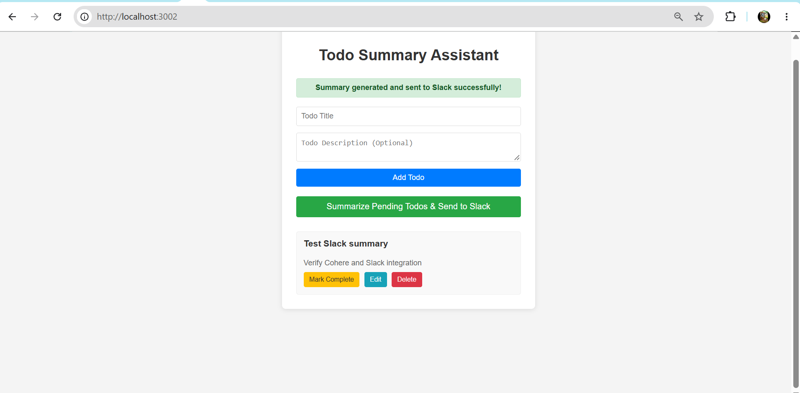
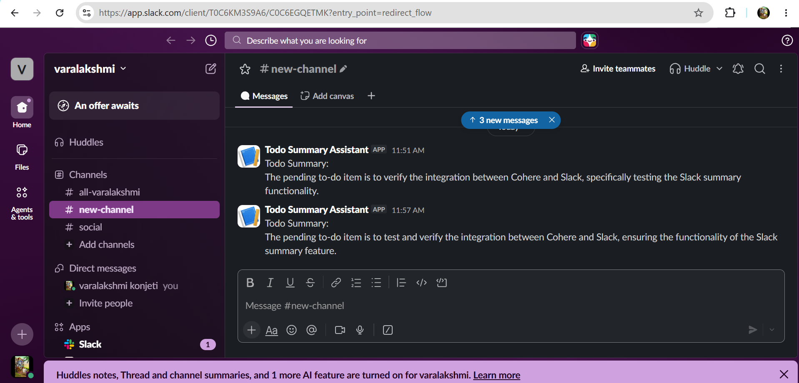
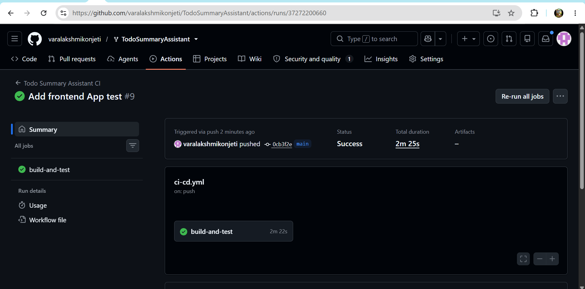
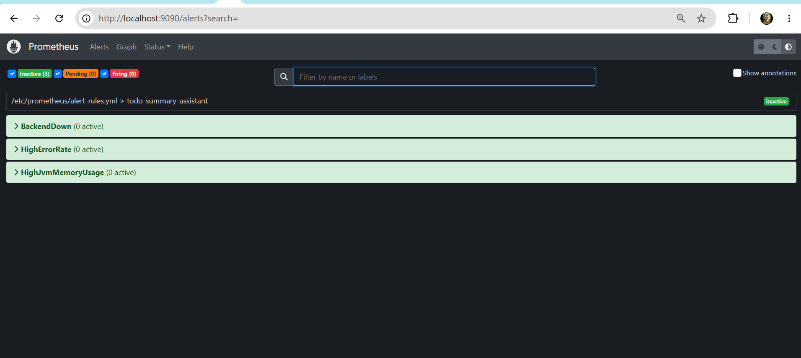
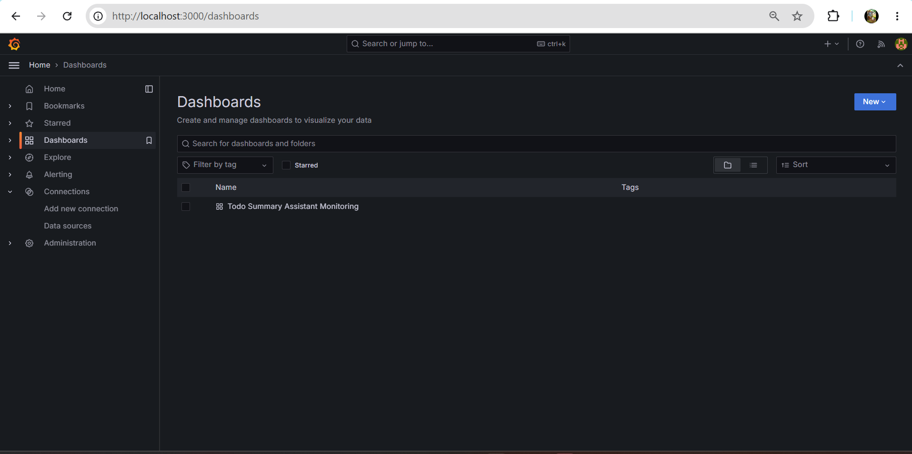
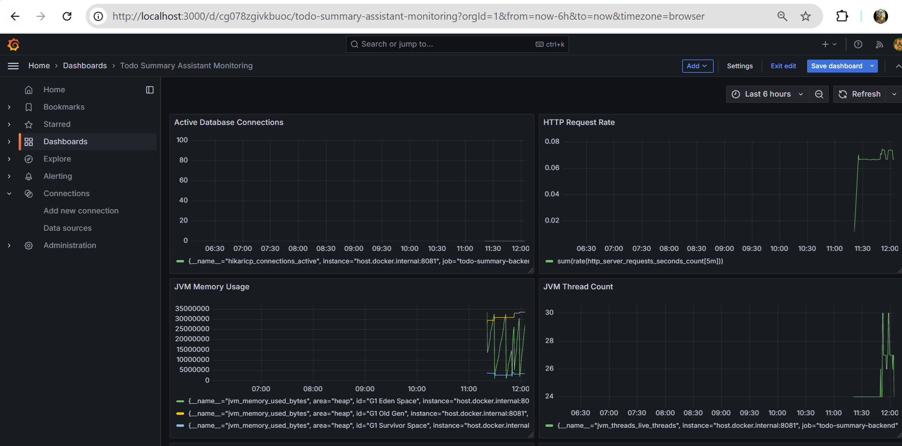
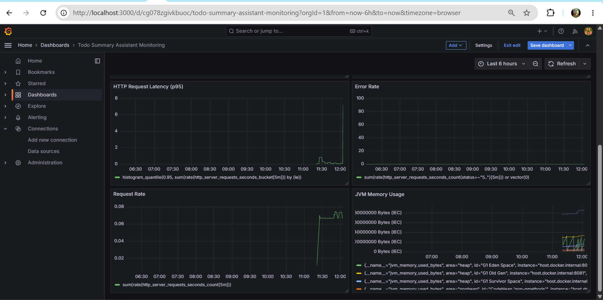

# Todo Summary Assistant

A full-stack Todo application built with React and Spring Boot that lets users create, update, delete, and complete todo items, generate an AI-powered summary of pending todos using Cohere, and send that summary to Slack.

The project also includes Docker containerization, automated tests, GitHub Actions CI, and Prometheus/Grafana monitoring.

## Table of Contents

- [Features](#features)
- [Tech Stack](#tech-stack)
- [Project Structure](#project-structure)
- [Architecture](#architecture)
- [Prerequisites](#prerequisites)
- [Configuration](#configuration)
- [Running Locally](#running-locally)
- [Running Tests](#running-tests)
- [Production Frontend Build](#production-frontend-build)
- [Docker](#docker)
- [Monitoring](#monitoring)
- [CI/CD](#cicd)
- [Application Screenshots](#application-screenshots)
- [Design Decisions](#design-decisions)
- [Security Notes](#security-notes)
- [Repository](#repository)

## Features

- Create todo items with a title and optional description
- View pending and completed todos
- Edit todo items
- Mark todos as complete or pending
- Delete todo items
- Generate an AI summary of pending todos using Cohere
- Send the generated summary to Slack using an Incoming Webhook
- Display success and error notifications
- Dockerized frontend and backend
- Prometheus metrics and alert rules
- Grafana monitoring dashboard
- Automated frontend and backend tests
- GitHub Actions CI pipeline

## Tech Stack

| Area | Technologies |
|------|--------------|
| Frontend | React, JavaScript, Axios, Jest, React Testing Library |
| Backend | Java 17, Spring Boot 3.4.5, Spring Data JPA, Hibernate, Maven, OkHttp |
| Database | MySQL (H2 in-memory for automated tests) |
| AI / LLM | Cohere API |
| Messaging | Slack Incoming Webhook |
| DevOps / Monitoring | Docker, GitHub Actions, Prometheus, Grafana |

## Project Structure

```text
TodoSummaryAssistant/
│
├── Backend/
│   └── todo-summary-assistant/
│       ├── src/
│       ├── pom.xml
│       ├── Dockerfile
│       └── .dockerignore
│
├── Frontend/
│   └── todo/
│       ├── src/
│       ├── package.json
│       ├── Dockerfile
│       └── .dockerignore
│
├── monitoring/
│   ├── prometheus.yml
│   └── alert-rules.yml
│
├── screenshots/
│   ├── application-running.png
│   ├── github-actions-success.png
│   ├── monitoring1.png
│   ├── monitoring2.png
│   ├── monitoring3.png
│   ├── prometheus.png
│   └── slack-summary.png
│
├── .env.example
├── .gitignore
└── README.md
```

## Architecture

                    ┌─────────────────────┐
                    │      React UI       │
                    │      Frontend       │
                    └──────────┬──────────┘
                               │
                               │ REST API
                               ▼
                    ┌─────────────────────┐
                    │   Spring Boot API   │
                    │      Backend        │
                    └──────┬───────┬──────┘
                           │       │
              ┌────────────┘       └─────────────┐
              ▼                                  ▼
       ┌──────────────┐                   ┌──────────────┐
       │    MySQL     │                   │    Cohere    │
       │   Database   │                   │     LLM      │
       └──────────────┘                   └──────┬───────┘
                                                 │
                                                 ▼
                                          ┌──────────────┐
                                          │    Slack     │
                                          │   Webhook    │
                                          └──────────────┘

                    ┌─────────────────────┐
                    │     Prometheus      │
                    │      Metrics        │
                    └──────────┬──────────┘
                               │
                               ▼
                    ┌─────────────────────┐
                    │      Grafana        │
                    │    Monitoring       │
                    └─────────────────────┘

## Prerequisites

Install the following before running the application locally:

- JDK 17+
- Maven
- Node.js and npm
- MySQL
- Docker Desktop
- Git

For the AI and Slack integrations you will also need:

- A Cohere API key
- A Slack Incoming Webhook URL

## Configuration

Create the required environment variables or configuration for the backend (for example in `application.properties`, or via environment variables).

> **Do not commit real API keys, passwords, or Slack webhook URLs to Git.**

Example configuration:

```properties
spring.datasource.url=jdbc:mysql://localhost:3306/todo_db?createDatabaseIfNotExist=true
spring.datasource.username=root
spring.datasource.password=YOUR_MYSQL_PASSWORD

cohere.api.key=YOUR_COHERE_API_KEY
slack.webhook.url=YOUR_SLACK_WEBHOOK_URL
```

Use `.env.example` as a reference for the required environment variables.

## Running Locally

### Backend

Navigate to the backend directory:

```bash
cd Backend/todo-summary-assistant
```

Build the application:

```bash
mvn clean verify
```

Run the Spring Boot application:

```bash
mvn spring-boot:run
```

The backend API runs on the port set by `server.port` in your configuration (the frontend is configured to call `http://localhost:8081/api/todos`).

### Frontend

Navigate to the frontend directory:

```bash
cd Frontend/todo
```

Install dependencies:

```bash
npm install
```

Start the React development server:

```bash
npm start
```

The frontend can then be opened in the browser (by default at `http://localhost:3000`).

## Running Tests

### Frontend

```bash
cd Frontend/todo
npm test -- --watchAll=false
```

The frontend test verifies that the Todo Summary Assistant UI and the Slack summary button render correctly.

### Backend

```bash
cd Backend/todo-summary-assistant
mvn clean verify
```

The backend test suite uses an H2 in-memory database, so no MySQL instance is needed for tests.

## Production Frontend Build

Create an optimized production build:

```bash
cd Frontend/todo
npm run build
```

The generated production files are placed in `Frontend/todo/build/`.

## Docker

The application includes separate Dockerfiles for the backend and frontend.

- The **backend** image uses a multi-stage Maven build and runs the application on a Java 17 runtime image.
- The **frontend** image uses Nginx to serve the React production build.

### Build Backend Image

From the repository root:

```bash
docker build -t todo-summary-backend:dev ./Backend/todo-summary-assistant
```

### Build Frontend Image

```bash
docker build -t todo-summary-frontend:dev ./Frontend/todo
```

### Verify Images

```bash
docker images todo-summary-backend
docker images todo-summary-frontend
```

## Monitoring

The project includes Prometheus and Grafana monitoring.

### Prometheus

- Configuration: `monitoring/prometheus.yml`
- Alert rules: `monitoring/alert-rules.yml`
- Local URL: <http://localhost:9090>

Configured alerts:

| Alert | Purpose |
|-------|---------|
| `BackendDown` | Backend service is unreachable |
| `HighErrorRate` | Elevated rate of failed requests |
| `HighJvmMemoryUsage` | JVM memory usage is unusually high |

### Grafana

Grafana is used to visualize application monitoring data.

- Local URL: <http://localhost:3000>

The monitoring setup provides visibility into application health, JVM metrics, and alert states.

> **Note:** Grafana and the React development server both default to port 3000. If you run them at the same time, start one of them on a different port.

## CI/CD

GitHub Actions is configured to automatically build and test the project whenever changes are pushed to the repository.

The CI workflow validates the application using automated frontend and backend checks.

## Application Screenshots

### Application Running



### Slack Summary

The application generates a summary of pending todos and sends it to Slack.



### GitHub Actions



### Prometheus Monitoring



### Grafana Monitoring







## Design Decisions

- **Separation of concerns:** The frontend and backend are separate applications, so they can be developed, tested, and containerized independently.
- **REST API:** The Spring Boot backend exposes REST endpoints for todo management and the summary feature.
- **Spring Data JPA:** Spring Data JPA and Hibernate simplify database access and persistence.
- **Service layer:** Business logic lives in service components for better maintainability and testability.
- **External API integration:** OkHttp is used to communicate with external services such as Cohere and Slack.
- **Monitoring:** Prometheus collects application metrics and Grafana provides visualization.
- **Automated testing:** The frontend uses Jest and React Testing Library; the backend uses Spring Boot testing with an H2 test database.
- **Containerization:** Separate Docker images for frontend and backend provide consistent deployment environments.

## Security Notes

- Never commit API keys or Slack webhook URLs.
- Do not commit real database passwords.
- Use environment variables or local configuration for secrets.
- Keep `.env` files containing secrets untracked (they should be listed in `.gitignore`).

## Repository

GitHub: <https://github.com/varalakshmikonjeti/TodoSummaryAssistant>